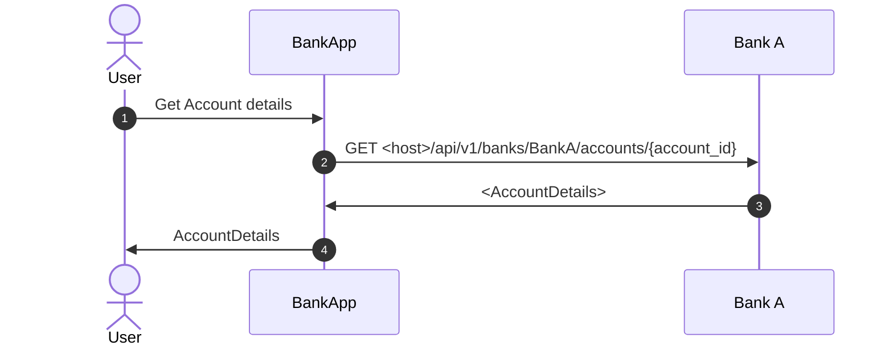

Running example, Bank API

```mermaid
    sequenceDiagram
    autonumber
    actor U as User
    Participant BA as BankApp
    Participant B as Bank A
    
	U->>BA: Get Account details
    BA->>B: GET <host>/api/v1/banks/BankA/accounts/{account_id}  
    B->>BA: <AccountDetails>
    BA->>U: AccountDetails 
```