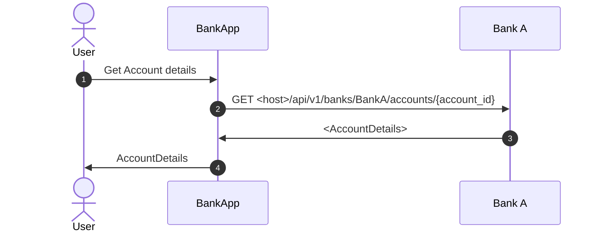

Running example, Bank API




## Consume the stubs from producer

To consume the stubs from bankA-producer, add this to the top of your test
```
@AutoConfigureStubRunner(ids = "com.lean.tech:bankA-producer:+:stubs:8090", stubsMode = StubRunnerProperties.StubsMode.LOCAL)
```

It downloads the stub jar from the LOCAL repository and runs a wiremock server in port 8090. 

If you prefer to download the stubs from the remote repository, then  
```
@AutoConfigureStubRunner(ids = "com.lean.tech:bankA-producer:+:stubs:8090", stubsMode = StubRunnerProperties.StubsMode.REMOTE)
```

If you prefer to retrieve it as a dependency, then add
```
@AutoConfigureStubRunner(ids = "com.lean.tech:bankA-producer:+:stubs:8090", stubsMode = StubRunnerProperties.StubsMode.CLASSPATH)
```
and add to the pom.xml:
```
<dependency>
    <groupId>com.lean.tech</groupId>
    <artifactId>bankA-producer-stubs</artifactId>
    <version>[0.0.0, )</version>
    <scope>test</scope>
</dependency>
```
Note that the version is intentionally not pinned, to allow the dependency to retrieve the latest available version of the dependency.
